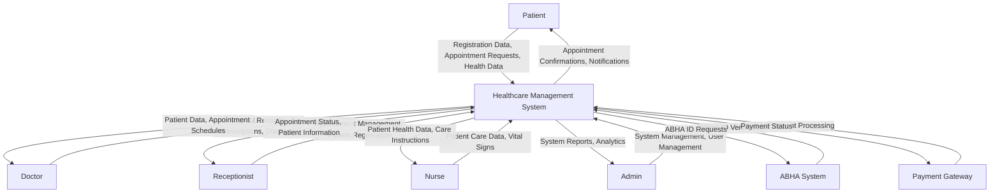
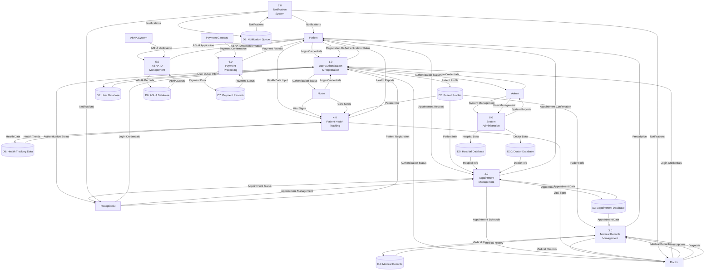
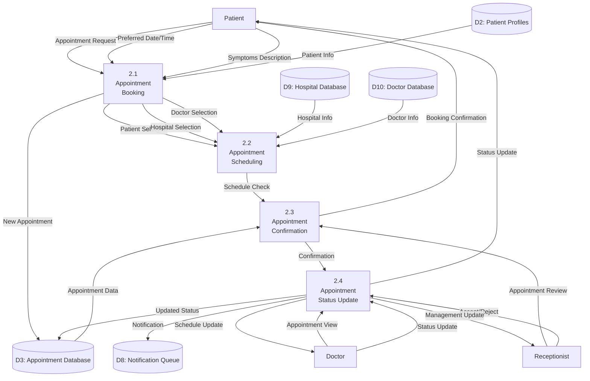
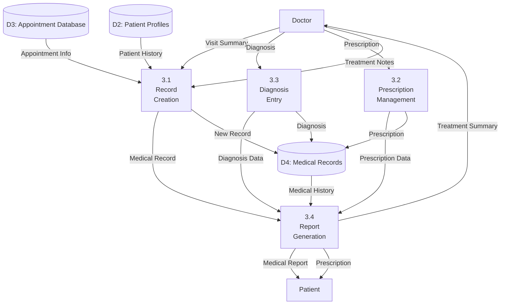

# Data Flow Diagram (DFD) - Healthcare Management System

## System Overview
This DFD represents the comprehensive healthcare management system "Jeevan" that handles patient registration, appointment booking, medical records management, and multi-role user interactions.

## Level 0 DFD - Context Diagram

## Level 1 DFD - Main Processes

## Level 2 DFD - Detailed Process Breakdown

### Process 2.0 - Appointment Management (Detailed)

### Process 3.0 - Medical Records Management (Detailed)

## Data Store Descriptions

### D1: User Database
- **Contents**: User credentials, roles, authentication data
- **Key Fields**: username, password, role, email, contact_number
- **Access**: All processes requiring authentication

### D2: Patient Profiles
- **Contents**: Complete patient information and health data
- **Key Fields**: full_name, gender, dob, address, abha_id, blood_group, allergies
- **Access**: Patient management, appointment booking, medical records

### D3: Appointment Database
- **Contents**: All appointment-related data
- **Key Fields**: patient_id, doctor_id, hospital_id, appointment_date, status, symptoms
- **Access**: Appointment management, scheduling, confirmation

### D4: Medical Records
- **Contents**: Patient medical history and treatment records
- **Key Fields**: appointment_id, patient_id, doctor_id, summary, diagnosis, prescription
- **Access**: Medical record management, prescription handling

### D5: Health Tracking Data
- **Contents**: Patient vital signs and wellness metrics
- **Key Fields**: patient_id, vital_signs, wellness_logs, medication_logs
- **Access**: Health monitoring, trend analysis

### D6: ABHA Database
- **Contents**: ABHA ID information and verification data
- **Key Fields**: abha_id, patient_id, verification_status, creation_date
- **Access**: ABHA management, patient identification

### D7: Payment Records
- **Contents**: Payment transactions and billing information
- **Key Fields**: appointment_id, amount, payment_mode, status, transaction_id
- **Access**: Payment processing, billing management

### D8: Notification Queue
- **Contents**: System notifications and alerts
- **Key Fields**: recipient_id, message, type, status, created_at
- **Access**: Notification system, alert management

### D9: Hospital Database
- **Contents**: Hospital information and configuration
- **Key Fields**: hospital_id, name, location, specialties, contact_info
- **Access**: Hospital management, appointment scheduling

### D10: Doctor Database
- **Contents**: Doctor profiles and specialization data
- **Key Fields**: doctor_id, hospital_id, specialization, experience, rating
- **Access**: Doctor management, appointment scheduling

## Key Data Flows

### Patient Registration Flow
1. Patient submits registration data → Process 1.0
2. Process 1.0 validates and stores data → D1, D2
3. System generates ABHA ID → Process 5.0 → D6
4. Confirmation sent → Process 7.0 → Patient

### Appointment Booking Flow
1. Patient requests appointment → Process 2.1
2. System checks availability → D3, D9, D10
3. Appointment scheduled → Process 2.2 → D3
4. Receptionist reviews → Process 2.3
5. Status updated → Process 2.4 → D3
6. Notification sent → Process 7.0 → Patient

### Medical Record Creation Flow
1. Doctor creates record → Process 3.1
2. System stores record → D4
3. Prescription generated → Process 3.2 → D4
4. Diagnosis recorded → Process 3.3 → D4
5. Report generated → Process 3.4 → Patient

## System Boundaries

### Internal Processes
- User authentication and registration
- Appointment management
- Medical records management
- Health tracking
- ABHA ID management
- Payment processing
- Notification system
- System administration

### External Entities
- Patients (end users)
- Doctors (medical professionals)
- Receptionists (hospital staff)
- Nurses (healthcare staff)
- Administrators (system managers)
- ABHA System (external verification)
- Payment Gateway (external processing)

## Security Considerations

### Data Protection
- All health data is PHI (Protected Health Information)
- Role-based access control implemented
- Audit trails for all data access
- Encryption for sensitive data transmission

### Access Control
- Patients can only access their own data
- Doctors can access patient data with proper authorization
- Receptionists have limited access to appointment data
- Administrators have system-wide access for management

## System Integration Points

### Frontend Integration
- React-based frontend for patient interface
- Django templates for staff interfaces
- RESTful API endpoints for data exchange

### External System Integration
- ABHA system for patient identification
- Payment gateway for transaction processing
- Notification services for alerts and reminders

This DFD provides a comprehensive view of the healthcare management system's data flows, processes, and data stores, enabling better understanding of the system architecture and data relationships.

